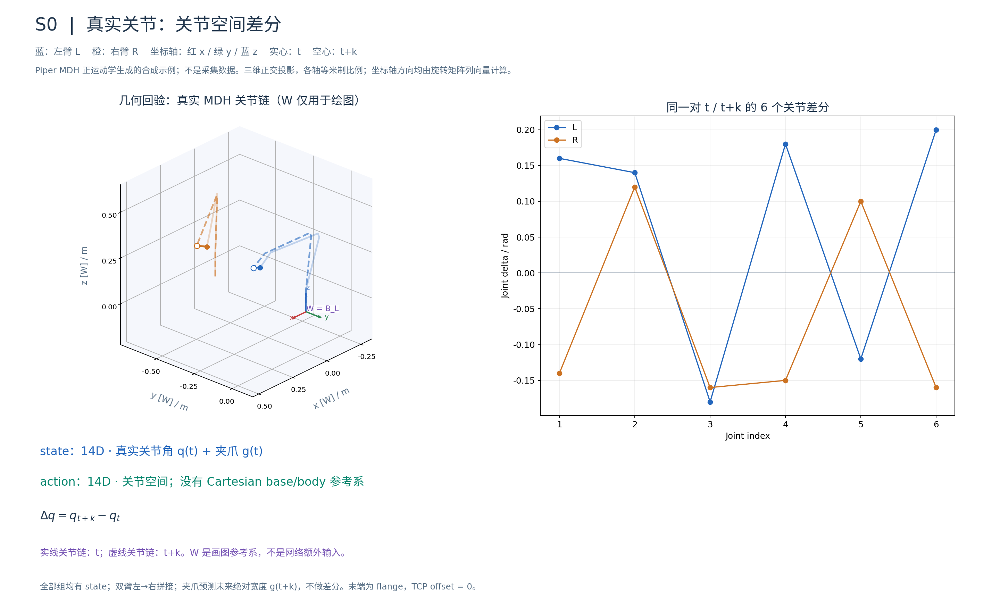
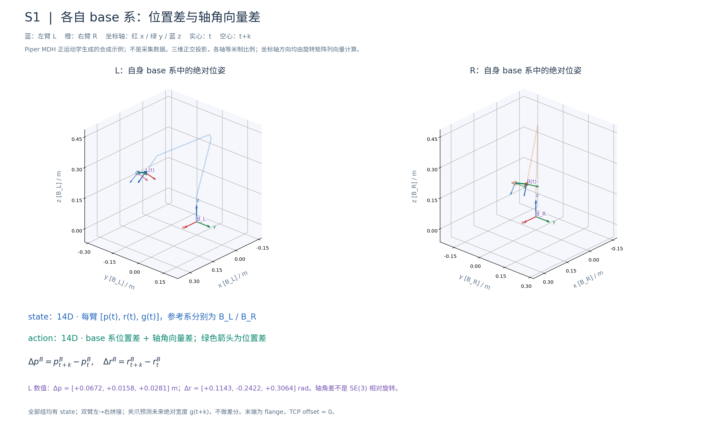
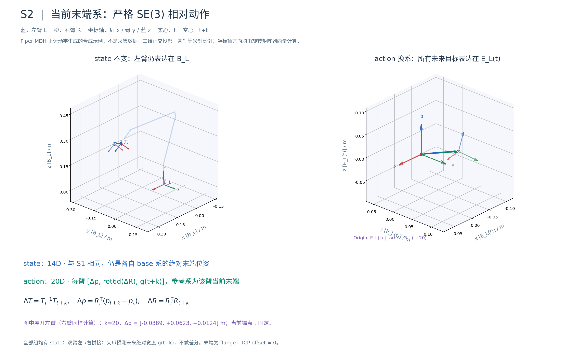
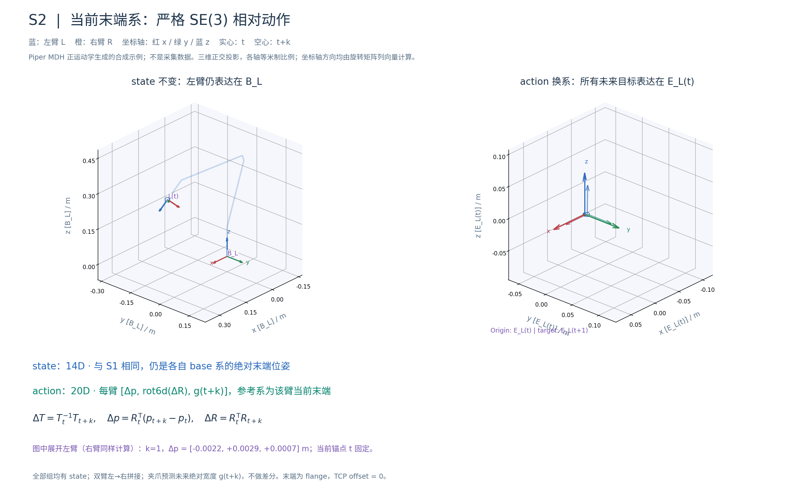
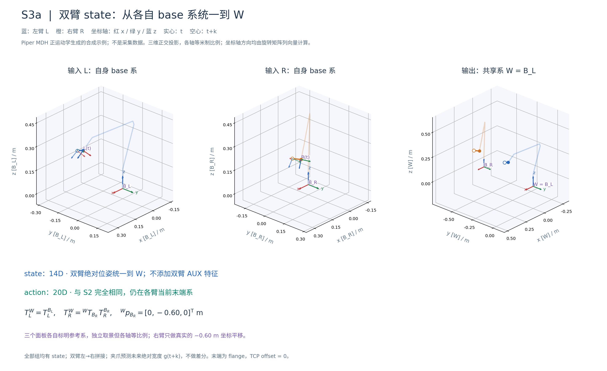
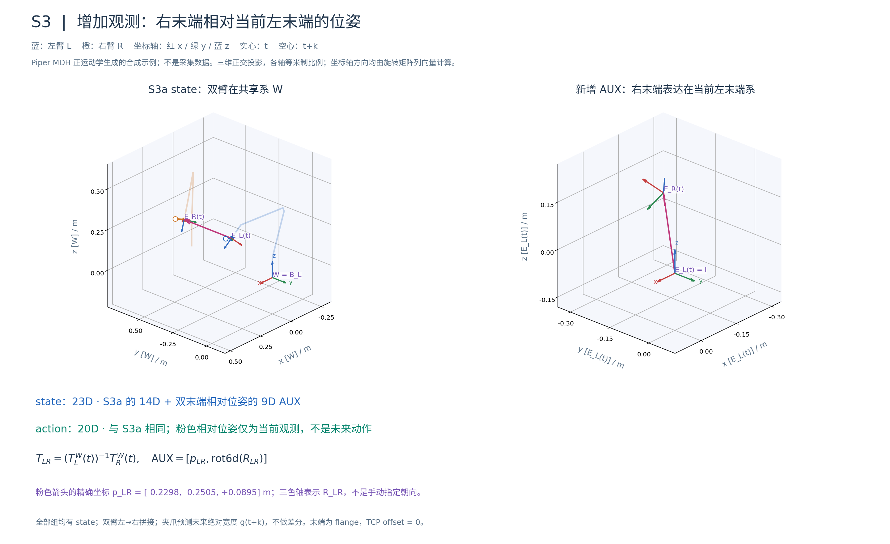
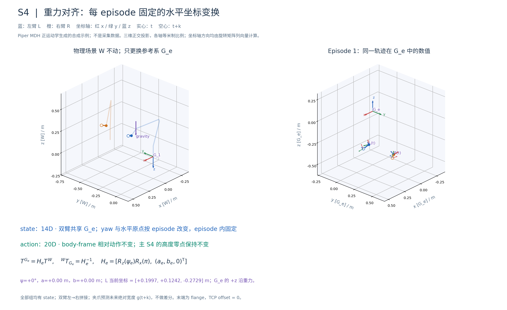
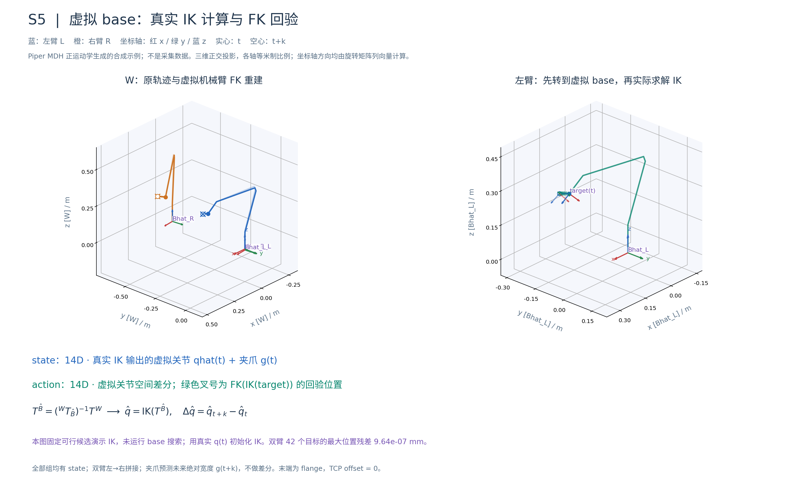
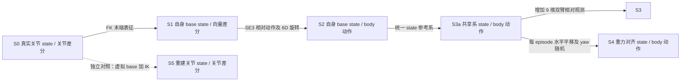
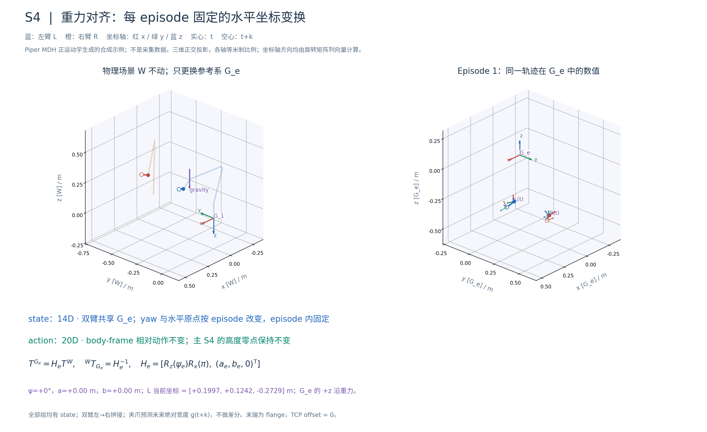

# Piper 双臂表征阶梯实验：关节 vs EEF vs UMI 式相对动作

> 目标：在花钱采集 UMI 数据之前，先用**有完整真值的真机遥操数据**量化「UMI 所缺失的信息」各自值多少钱。
> 相关调研见 [UMI 及相关工作调研](umi_survey.md)。

## 0. 实验目标与汇报口径

最终目标是判断 UMI 数据能否替代真机遥操数据。本组先用同一批具有完整关节反馈的真机遥操数据，比较关节与末端表征、动作相对约定、共享坐标系、双臂几何特征，以及虚拟 base 重建的代价，回答：**采集 UMI 数据之前，策略在 UMI 式表征下能否学好折布任务，应选择哪种 state/action 定义？**

本组直接测量的是表征变化的代价。验证数据来源能否替代，仍需真实 UMI 数据的训练集替换实验，并控制视觉、轨迹质量和本体差异。各组不是严格的信息逐级消去链：S3 增加显式几何特征，S5 是独立重建分支，应按指定对照归因。

## 1. 数据

`/mnt/xiaoyu_teleop_data/piper/20260907/piper_fold_cloth_in_place`（只读，LeRobot v2.1）

| | |
|---|---|
| 规模 | 1255 episodes / 1,566,008 帧 / 30 fps / **14.5 小时** |
| 相机 | 3 路 480×640 H.264（`info.json` 里写的 `av1` 是过期元数据；随机 seek 实测 2 ms/帧） |
| 任务 | `Task: fold the cloth. Scene: internal. Type: teleop. Quality: 5.` |
| 划分 | 1192 train / 63 held out，固定 seed，**全部实验共用** |

### 关键字段（均经数值验证）

| 字段 | 含义 |
|---|---|
| `observation.state` (14) | `[L j1..j6, L 夹爪, R j1..j6, R 夹爪]`，弧度 + 米 |
| `observation.qpos_ee` (16) | 每臂 `[xyz, quat(x,y,z,w), 夹爪]`，**各自 base 系**、**flange** 处、TCP offset = 0 |
| `observation.state_all` (28) | `concat(从臂 14, 主臂 14)` |
| `action` (14) | **精确等于** `observation.state[t+1]`（max abs diff = 0.0） |
| `action_mas` (14) | 主臂（leader）关节，领先从臂 |

两条重要事实：

1. **`qpos_ee` 就是关节角的 FK**：`fk_from_mdh(get_mdh("piper"), joints)`，左臂位置误差 5.5e-6 m。
   所以运动学有精确地基，不需要 URDF、不需要 pinocchio。
2. **数据里没有双臂 base 外参，也没有相机标定。** 双臂面朝前并排、间隔 60 cm、都往中间伸，
   所以右臂 base 位于左臂 base 的 **−y** 方向 0.60 m（`piper.T_RIGHT_BASE_TO_LEFT_BASE`）。
   符号已由数据验证：反号会把双爪平均间距从 0.50 m 拉到 0.72 m，正号则把两个工作空间拼成一个
   连续带、中间有 27 cm 重叠区，符合两臂共同操作同一块布。

### 为什么重新算 FK 而不用 `qpos_ee`

采集机分别采样关节反馈和末端位姿反馈两组 CAN 报文，快速运动时两者不一致：中位帧只差 3.6 µm，
但 5% 的帧超过 1 mm，最大 6 mm。转换脚本因此**从关节角重算位姿**，
保证所有表征描述的是**同一条轨迹** —— 否则 S0 与 S1 之间的差异里会混入这点不一致，实验就不可归因。

## 2. 实验设计（可直接用于汇报）

### 统一术语

所有组均 **有 state，`add_state=True`**。下表维度指归一化、padding 前的有效维度；action 指模型训练目标，不是磁盘原始 `action` 字段。所有组固定同一数据划分、三路图像、从臂目标、初始化、`chunk_size=50`、学习率、优化器、训练步数和 seed。夹爪始终预测**未来绝对开口宽度（米）**，不做差分。

- `q_t`：单臂 6 维关节角；`g_t`：夹爪宽度。
- `T_t^F=[R_t^F,p_t^F]`：末端局部系到参考系 `F` 的变换；本实验末端均为 **flange，TCP offset=0**。`r_t^F` 为轴角向量。
- `B_L/B_R`：各臂自身 base 系；`W`：以左臂 base 为原点的共享系；`G_e`：episode `e` 的重力对齐共享系。
- `k=1…50`：相对当前观测时刻 `t` 的未来步。整个 chunk 共用 `t` 为锚点，不是相邻未来帧逐步相减。
- `rot6d(R)`：旋转矩阵前两行依次拼接，6 维。双臂默认 **左臂在前、右臂在后**。

### 统一实验表

| 组别 | state 是否输入 / 维度 | state 内容及参考系 | 模型 action / 维度 | delta 所在空间或坐标系 | 指定对照与变化 |
|---|---|---|---|---|---|
| **S0** | 是 / 14 | 每臂 `[q_t,g_t]`，真实关节状态 | 每臂 `[q_{t+k}−q_t,g_{t+k}]` / 14 | **关节空间**，不适用 Cartesian base/body 系 | 基线 |
| **S1** | 是 / 14 | 每臂 `[p_t,r_t,g_t]`，各自 `B_L/B_R` | 每臂 `[p_{t+k}−p_t,r_{t+k}−r_t,g_{t+k}]` / 14 | 位置差在各自 base 系；旋转为轴角向量差 | 对 S0：关节表征改为 FK 末端表征 |
| **S2** | 是 / 14 | 同 S1，各自 `B_L/B_R` | 每臂 `[Δp,rot6d(ΔR),g_{t+k}]` / 20 | 各臂当前末端局部系，`ΔT=(T_t)⁻¹T_{t+k}` | 对 S1：动作编码由向量差改为 SE(3) 相对变换，同时旋转改为 6D |
| **S3a** | 是 / 14 | 每臂 `[p_t,r_t,g_t]`，统一到 `W` | 同 S2 / 20 | 各臂当前末端局部系 | 对 S2：只统一 state 的参考系 |
| **S3** | 是 / 23 | S3a 的 state + `T_L⁻¹T_R` 的 `[xyz,rot6d]`（9 维） | 同 S2 / 20 | 各臂当前末端局部系 | 对 S3a：只增加双末端相对位姿观测 |
| **S4（新设计，待实现）** | 是 / 14 | 每臂 `[p_t,r_t,g_t]`，统一到 `G_e`；z 轴重力对齐，水平原点及 yaw 每 episode 随机 | 同 S2 / 20 | 各臂当前末端局部系 | 对 S3a：只移除跨 episode 固定的水平坐标参考；详见 §5 |
| **S5** | 是 / 14 | 每臂 `[q̂_t,g_t]`，由虚拟 base 下的 IK 重建 | 每臂 `[q̂_{t+k}−q̂_t,g_{t+k}]` / 14 | 虚拟机械臂的关节空间 | 对 S0：真实关节轨迹改为虚拟 base + IK 重建轨迹 |

这里的对照顺序为 `S0 → S1 → S2 → S3a`，随后由 S3a 分出 S3 和 S4；S5 与 S0 比较。S1→S2 测的是整套动作编码选择，不能单独归因为 body-frame 的收益，因为旋转编码和输出维度也改变了。

### 各组统一说明

下图由 Python / Matplotlib 按数值计算绘制，使用三维正交投影和等米制轴比例。输入为固定的双臂合成关节轨迹，经 Piper SDK 对应的 MDH 模型计算 FK；坐标轴严格取各旋转矩阵的列向量，连杆折线由 MDH 链计算。红/绿/蓝分别表示局部 x/y/z 轴，深色轴为当前 t，淡色轴为目标 t+k。图示用于验证表征定义，不是采集数据或训练结果；不同面板分别标明参考系和米制刻度，不能以像素距离跨面板比较。输出仅为 PNG / GIF。

**S0｜真实关节基线。** state 输入真实关节角与夹爪；磁盘 `action[t]=state[t+1]` 是绝对目标，训练时才转成相对当前关节角的差分。网络没有显式输入 base 外参；机械臂运动学和固定安装关系是数据生成背景，不能说 state 含有真实 base 或双臂外参。



**S1｜自身 base 系末端向量差分。** 用同一关节反馈经 FK 得到 flange 位姿，state 保留各自 base 系的绝对末端位姿。action 的平移部分是 base 系位置差，旋转部分是轴角向量逐元素差；后者一般不等于 `Log(R_tᵀR_{t+k})`，因此不称为严格 SE(3) 增量。



**S2｜当前末端系相对动作。** state 与 S1 完全相同，磁盘数据也相同，仅训练编码变化：`Δp=R_tᵀ(p_{t+k}−p_t)`，`ΔR=R_tᵀR_{t+k}`。它回答“以当前 flange 为原点、以当前 flange 的朝向为坐标轴，未来目标在哪里、朝向如何”。相对 action 对共同左乘的参考系变换不变，但绝对 state 仍依赖参考系。





S2 动画两侧使用同一个未来目标：左侧在 base 系中显示，右侧由 `T_t⁻¹T_{t+k}` 得到；当前锚点 t 固定。各面板的坐标轴范围和相机视角在动画中固定。

**S3a｜共享系末端观测。** 把双臂位姿统一到 `W`；右臂使用安装假设 `T_{B_R→W}`，平移为 `[0,−0.60,0] m`、旋转为单位阵。保留 body-frame action。该外参来自安装信息及数据一致性检查，不是原数据里的标定字段。



**S3｜显式双臂几何观测。** 在 S3a 上增加当前右末端相对左末端的位姿 `T_L⁻¹T_R`，表达在当前左末端系；只作为 state 的 9 维 AUX 特征，不进入 action，不做动作差分。



**S4｜重力对齐、水平参考随机的共享系观测。** 保留 state 和双臂共享几何，按 episode 共同随机化水平平移与 yaw；同一 episode 内固定，双臂使用同一变换。动作沿用 S2 的 body-frame 编码。具体定义、与 HiFi-UMI 的对应关系见 §5。



**S5｜虚拟 base 重建关节。** 从共享系 EEF 轨迹估计可用的虚拟 base，在该 base 下做 IK 得到 `q̂`，按 S0 的关节差分训练。IK 既用于评估可行性，也用于生成训练 state/action；本组不再混写成“按 S0/S1 训练”。它联合测量 base 选择与 IK 重建误差，不是单纯 base 定位精度实验，详见 §6。





## 3. 复现步骤

> **先确认可用 CPU 数。** 本机 `nproc` 报 160，但 cgroup 配额只有 **15 核**
> （`cat /sys/fs/cgroup/cpu.max` → `1500000 100000`）。按 160 开 worker 会严重超订：
> S5 的 IK 转换从 ~15 核满载时的可接受速度掉到 **1 episode/分钟**。
> 所有脚本的 `--workers` 请按下式取：
> ```bash
> echo $(( $(cut -d' ' -f1 /sys/fs/cgroup/cpu.max) / $(cut -d' ' -f2 /sys/fs/cgroup/cpu.max) ))
> ```

```bash
# 1. 转换（15 核约 5 分钟；不复制视频，帧引用指向只读挂载）
python script/piper_lerobot_to_jsonl.py --out-root ./data/piper_fold_cloth --workers 15

# 2. 预计算归一化统计（每级约 3-4 分钟；不做的话训练时 rank0 现算、其余 rank 空等）
python script/piper_compute_norm_stats.py --workers 15

# 3. 逐级训练（8 卡）
script/dm05_launcher.sh --exp playground/dm05_piper.py --task train --nproc_per_node 8 \
    --data-config.dataset-name piper_fold_s0 \
    --model-config.model-name-or-path ./checkpoints/DM05-MEM \
    --trainer-config.output-dir user_checkpoints/piper_s0 \
    --trainer-config.wandb-project opendm

# S2 / S3 / S3a 额外加 --data-config.relative-mode se3
script/dm05_launcher.sh --exp playground/dm05_piper.py --task train --nproc_per_node 8 \
    --data-config.dataset-name piper_fold_s2 --data-config.relative-mode se3 \
    --model-config.model-name-or-path ./checkpoints/DM05-MEM \
    --trainer-config.output-dir user_checkpoints/piper_s2 \
    --trainer-config.wandb-project opendm

# 4. 离线统一空间评测
python script/piper_eval_offline.py \
    --checkpoint user_checkpoints/piper_s0/checkpoint-60000 \
    --dataset-name piper_fold_s0 --samples 512 --out results/s0.json
python script/piper_eval_offline.py --compare results/*.json
```

S5 需要先估 base 再生成数据，见 §6 末。

基础权重需先下载：`huggingface-cli download Dexmal/DM05 --local-dir ./checkpoints/DM05`。

> **坑**：`DM05DataConfig.norm_stats_path` 的 digest 只哈希 `dataset_name` 和 action transform，
> **不含** `state_desc`。所以每级必须用不同的 `dataset_name`，否则归一化统计会静默串用。
> 现有 6 个注册名已满足这一点。

## 4. 为什么不能直接比 loss

各级动作空间不同：S0 预测关节角增量（弧度），S1 预测 base 系位姿增量（米 + 轴角），
S2/S3a/S3/S4 预测 body-frame SE(3) 变换（米 + 6D 旋转）。**原始 loss 数值不可比。**

`script/piper_eval_offline.py` 把每级预测解码到同一物理量：

> **每臂在其自身 base 系下的绝对 flange 位姿（mm / deg）+ 夹爪宽度（mm）**

关节级经 FK 前向，EEF 级解开相对编码（统一系的还要把右臂映射回自己的 base 系 —— 漏掉这一步
会让右臂误差里多出一个恒定的 0.6 m，S3 会被冤枉成灾难性地差）。
按 chunk 内 `k = 1, 10, 25, 50` 分别报告，暴露长程漂移。

真值直接从留出 episode 的绝对 state 读，**不是**反解预测编码得来的 ——
避免解码器的 bug 在预测和真值两边相互抵消。

`tests/test_piper_common_space.py` 里有一条关键测试：把同一条轨迹分别按 S0 和 S2 编码再解码，
要求得到**相同的位姿**。如果这条不过，任何 S0/S2 差异都只是解码噪声。

## 5. S4：重力对齐、水平坐标随机（训练实验）



动画离散切换三个 episode 的参考系，每次停留 2.5 秒；同一 FK 轨迹仅用于对比坐标表达。左图在原世界 W 中显示固定物理轨迹，新坐标系的位置和朝向严格按 `H_e⁻¹` 绘制；右图所有末端位置与朝向均按 `H_e T^W` 计算。两侧轴范围与相机视角全程固定，不发生自动缩放。G 的 `+z` 沿重力，但右图画的是 G 的数值坐标，所以图中正 z 朝上的显示方向不代表物理向上。episode 内参考系固定，高度零点不变。

### 变换定义

基于 S3a，先使用固定旋转 `C` 将共享系 z 轴按选定符号与重力对齐，再对每个 episode 抽取一个固定变换：

```text
H_e = [ Rz(ψ_e) C   (a_e, b_e, 0)ᵀ ]
      [     0               1       ]
T_t^{G_e} = H_e T_t^W
```

`ψ_e` 建议均匀采样于 `[−π,π)`；`a_e,b_e` 的范围应写入实验配置并在训练前固定。使用固定 seed 与 episode ID 生成并保存变换，双臂、当前 state 和全部未来目标共同使用 `H_e`，整个 episode 内不重采样。这里只改变坐标表达，不改变物理轨迹或原始图像；若后续引入相机外参，其坐标表达也需同步转换。

为保持 S3a→S4 的单因素比较，固定重力符号转换 `C` 应同样用于对照 S3a（其余共享系组也统一约定）。若原 Piper `+z` 向上而目标规定 `+z` 向下，可选绕 x 轴旋转 π 的正规旋转；不能只取负 z 而生成左手系。

主实验按本次需求只随机化 **x/y 平移与 yaw**，保留共同高度零点。重力只提供竖直方向，不提供绝对高度：因此本组保留高度零点是控制变量选择，不是 IMU 能测得它。若希望进一步模拟任意三维原点，另设 `S4-origin` 对照，额外随机化每 episode 固定的 z 平移，不混入主 S4。

六轴 IMU 的加速度计在静止或适当融合条件下可提供重力参考，陀螺仪提供角速度；动态加速度、偏置和估计误差仍会影响姿态，不能描述为 roll/pitch “完全不漂移”。这里用理想坐标变换模拟部分参考系缺失，不模拟传感器误差。关于重力参考的背景可参见 [VectorNav AHRS 动态加速度说明](https://www.vectornav.com/solutions/ahrs)。

### 为什么 action 不变，训练仍然有意义

```text
(T_t^{G_e})⁻¹ T_{t+k}^{G_e}
= (H_e T_t^W)⁻¹ (H_e T_{t+k}^W)
= (T_t^W)⁻¹ T_{t+k}^W
```

body-frame action 在数值容差内不变，**输入的绝对位姿 state 改变**。因此 S4 测量的是失去跨 episode 固定水平参考后，模型利用 state 学习的能力。旧版“相对动作不变，所以训练不可能有差异”的推论忽略了 state 输入，本节替换该旧定义。

现有 `tests/test_action_frames.py::test_relative_se3_targets_are_world_frame_invariant` 继续用于检查动作不变性；它不能替代 S4 训练。新增管线应检查：双臂共用变换、episode 内固定、state 确实变化、body action 与双臂相对位姿保持不变，以及解码后能经 `H_e⁻¹` 回到原共享系再做统一评测。S4 需独立数据注册与归一化统计；当前仓库尚未实现这些步骤。

### 与 HiFi-UMI-2K 对齐到哪一层

依据 [HiFi-UMI-2K 数据卡的 State and Action Representation / Coordinate Frames](https://huggingface.co/datasets/simple-world-lab/HiFi-UMI-2K#-state-and-action-representation)（核对日期：2026-09-10）：

| 项目 | HiFi-UMI-2K 公开定义 | 本组采用的处理 |
|---|---|---|
| state / 磁盘 action | 均为 20 维；action 是绝对下一状态目标 | S4 保留 14 维轴角 state，训练 action 转为 20 维 body 相对目标，避免同时改变 state 编码 |
| 顺序与旋转 | 右手在前、左手在后；旋转矩阵前两行的 6D 表示 | Piper 保持左→右；6D 行约定一致，接入时显式交换左右块 |
| 夹爪 | 开口角，rad | Piper 开口宽度，m；需设备几何映射，不能直接互换 |
| 末端原点 | 指尖 | Piper flange；接入时需标定局部轴和 flange→指尖变换 |
| 世界系 | 双手和头部共享；原点任意；数据卡写明 `+Z` 与重力同向 | S4 双臂共享、z 符号显式统一；随机水平原点及 yaw |
| 高度原点 | 未规定跨 recording 的共同高度零点 | 主 S4 保留高度零点；`S4-origin` 才进一步消除此参考 |

数据卡没有规定水平随机化的概率分布；这里的 episode 随机化是模拟坐标任意性的实验设计，不是声称数据发布方按该分布采样。**S4 对齐的是坐标信息假设，并非直接复刻 HiFi-UMI 的存储格式。** 若要比较 20 维 6D state，应让 S3a 与 S4 同时增加这一对照，避免把编码收益归入坐标随机化收益。

## 6. S5：base 其实估不准，而且这不影响可用性

**实测结论：从 EEF 轨迹几何上无法唯一确定 base。**

Piper 的 joint 1 是绕 base z 轴的纯旋转，所以 flange 的柱面半径与高度**与 j1 无关**。
在重力对齐的世界系下（UMI 靠 IMU 能拿到），可达性因此退化成只关于 base **位置**的、
偏航无关的二维条件 —— 在已知 base 竖直安装、roll/pitch 固定的假设下，完整候选为 xyz+yaw 共 4 维；阶段 1 仅搜索 xyz 三维，yaw 留给阶段 2。该位置包络忽略 joint 1 方位限位及末端姿态，只用于候选过滤。

但在这批数据上，该条件被一个 **0.7 × 0.65 × 0.4 m** 的位置集合*精确*满足（6103 帧覆盖下 779 个网格点，
5 cm 间隔）—— 演示动作只占据工作空间内部的一小块，硬可达性根本约束不住 base。
`tests/test_piper_estimate_root.py::test_reachability_alone_does_not_identify_the_base`
把这个负面结论固化成测试：如果哪天可行集变小了，估计器的整个定位就需要重新审视。

### 五个具体的失败教训（原计划里的目标函数是错的）

1. **「最小化双爪距离」完全不可用**：在 −0.70 → −0.40 m 上单调下降。两只爪抓布的不同角，永远不重合。
2. **「关节限位越界量」恒为 0**：`ik` 会把解裁剪到限位内，该项在构造上永远取不到正值。
   改成报告「贴限位的帧比例」(`pinned_frac`) 与 5 分位余量。
3. **基于 IK 残差 / 可达比例的目标非单调**：真值 −0.60 处「不可达」比例 44.6%，而 −0.80 处只有 23.2%。
   这些数字反映的是求解器从坏种子出发失败，不是几何不可达。用 `piper.ik_multistart` 才能把两者分开。
4. **平滑度与解支翻转率必须在原生帧率上算。** 第一版按 stride 200 抽帧打分，
   相邻「帧」相隔 6.7 秒，测出 83.7% 的「解支翻转」—— 那只是机械臂真的动了。
   现在打分改为在**连续片段**（默认 40 帧 @30 Hz）上进行。
   实测同一条轨迹：原生 30 Hz 下翻转率 0.17%，按 stride 6 抽样就变成 15–20%。
5. **`ik_track` 的重试条件必须看残差，不能只看漂移**（这是一个真实的 bug，已修）。
   一次「卡住」的求解几乎不会离开种子，所以它的**漂移很小** —— 只按漂移触发重试，
   卡住的帧就会被放行，然后它的坏解又成为下一帧的 warm start，级联失败。
   实测该 bug 让 31%–65% 的帧被误报为「不可达」，而多起点求解器能 40/40 全部解出。
   修复后不可达率降到 **0.0%**。`tests/test_piper_kinematics.py::test_ik_track_retries_on_a_stalled_solve_not_only_on_a_jump`
   固化了这条（restarts=0 时该轨迹 31.2% 不可达，修复后 0.0%）。

> 这五条有一个共同主题：**在一个非冗余 6-DoF 臂上，「求解器失败」和「几何不可行」很容易混淆。**
> 任何用 IK 结果做判据的地方，都必须先用多起点把两者分开，否则测的是求解器不是机器人。

`script/piper_estimate_root.py` 因此不假装能识别真 base，而是在可行集中挑**关节轨迹综合质量较好**的候选（并非优化一个严格定义的轨迹条件数）：
关节远离限位、Jacobian 远离奇异、轨迹平滑、解支不翻转。

**这对下游是正确的取舍**：训练和部署必须使用同一个虚拟 base，并通过 FK、坐标变换及真实机械臂 IK 映射目标；在 IK 可行且解支稳定的范围内，可将其看作一致的重参数化。
真正有害的是关节顶到限位、IK 解支翻转、以及近奇异构型 —— 后者实测下 j5≈0 时 j4/j6 轴共线，
σ_min 掉三个数量级，此时**亚毫米的位姿误差会放大成几十毫弧度的关节误差**
（`piper.min_singular_value` 就是为了让这一点可被监控）。

所以 S5 的正确解读不是「base 估得准不准」，而是
**「在 base 不可辨识的前提下，选一个自洽的虚拟 base 再 IK 回关节，策略还能不能用」**。

### S5 数据生成与放行门槛

```bash
# --episodes 管覆盖（便宜，尽量大）；--max-segments 管 IK 打分预算（贵，保持小）
python script/piper_estimate_root.py --episodes 60 --max-segments 12 --workers 15
python script/piper_ik_to_joints.py --workers 15                  # 全量 IK → joint_estimated_base/（15 核约 1-2 小时）
python script/piper_compute_norm_stats.py --rung s5
```

估计器分两个阶段，**样本需求不同**（这点很重要）：

- **阶段 1（可行性）**只是查表，应该看**尽可能多**的帧。否则选出的 base 只对拟合时看到的那一小片
  工作空间可行，后面全量 IK 会报告大量「不可达」。用 `--episodes` 提高覆盖（每 10 帧抽 1 帧，很便宜）。
  实测：320 帧覆盖 → 可行集 1708 个格点（0.75×0.9×0.45 m）；6103 帧覆盖 → 779 个（0.7×0.65×0.4 m）。
  覆盖越多约束越紧，但**始终远未收敛到唯一解**。
- **阶段 2（轨迹综合质量）**在 xyz+yaw 候选上抽样打分，再用局部坐标下降细化。每个候选 base 要对每帧做一次 IK，是耗时瓶颈（纯 Python 约 12 ms/解），
  所以只用少量**连续片段**。用 `--max-segments` / `--grid-size` / `--refine-rounds` / `--segment-length`
  控制预算，`--workers` 并行（打分之间相互独立）。
  **两者已解耦**：`--episodes` 只影响覆盖，`--max-segments` 只影响 IK 成本。

当前 `conditioning_cost` 的加权项为位置未达阈值比例、平均位置残差、贴限位比例、近奇异比例、平均关节步长及解支翻转比例；姿态残差另行报告，尚未进入总分。表中的“不可达”是求解结果未达阈值的统计，不是严格的几何不可达证明。base 拟合及阈值选择应仅使用 train split，held out 只用于冻结后的验证。

### 实测结果（修复 IK bug 后；60 episodes 覆盖 = 6103 帧、12 打分片段）

| 臂 | 估计 base | 与真值误差 | IK 残差 | 不可达 | 贴限位 | 近奇异 | **解支翻转** |
|---|---|---|---|---|---|---|---|
| 左 | `[0.045, 0.264, 0.098]` yaw 0 | 0.285 m | 0.00 mm | 0.0% | 0.8% | 0.0% | **0.0%** |
| 右 | `[-0.185, -0.433, 0.071]` yaw −0.40 | 0.260 m | 0.00 mm | 0.0% | 0.0% | 0.0% | **0.0%** |

全量转换抽验（4 episodes × 2 split，完整 episode）：

| 臂 | IK 残差 | 不可达 | **解支翻转** | 近奇异 |
|---|---|---|---|---|
| 左 | 2.425 mm | 7.77% | **0.43%** | 0.07% |
| 右 | 0.451 mm | 3.78% | **0.38%** | 1.18% |

**解支翻转 0.38–0.43%，低于原定 5% 门槛；是否放行还须同时评估位置/姿态残差、未达阈值帧比例和任务容忍度。**

注意 base 误差在不同随机种子/参数下会在 **0.115–0.285 m** 之间跳动，而条件数指标始终干净。
这恰恰是「不可辨识但可用」的表现：可行集里有很多点都能给出干净的关节轨迹，
搜索落在哪个点很大程度上是运气，但**应以全量轨迹的可行性与重建质量决定候选能否使用**。

### 一个尚未解决的限制：位置可达 ≠ 6-DoF 可达

阶段 1 的可行性判据**只看位置**（柱面半径 + 高度）。实测发现：
即使位置包络通过率 100%，完整 episode 里仍有 **2–10% 的帧未能求得满足完整位姿的 IK 解**。位置包络通过不保证指定姿态可达。

为排查求解器问题，对这些帧用 `piper.ik_multistart` 加 24 个随机种子重解，
只能救回 1/30 和 2/30，提示这些目标较难满足完整位姿约束；有限次多起点失败仍不能严格证明几何不可达。

影响可控：`ik` 对够不到的帧返回**求解器找到的近似解**（不保证全局最近），所以 S5 的关节目标仍然连续，
只是那些帧带有几毫米的位姿误差（全量抽验平均 2.4 mm / 0.45 mm）。
若要进一步降低，方向是把姿态可行性也纳入阶段 1，或让阶段 2 的 `unreached_frac`
在更宽的覆盖上评估（目前只在 12 个打分片段上）。

## 7. 新增代码地图

| 文件 | 作用 |
|---|---|
| `opendm/data/se3.py` | SE(3)/旋转工具：四元数、轴角、rpy、**6D 旋转**（仓库原先没有）、序列解缠 |
| `opendm/kinematics/piper.py` | 批量 FK、解析 Jacobian、DLS IK、多起点 IK、序列跟踪 IK、σ_min、双臂外参 |
| `opendm/data/transforms.py` | 新增 `ActionRelativeSE3` / `ActionAbsoluteSE3`；`BuildAction` 新增 `relative_mode` |
| `opendm/dataset/piper_dual.py` | 6 个阶梯的数据集注册 |
| `opendm/eval/piper_common_space.py` | 跨表征统一空间解码器 + 指标 |
| `playground/dm05_piper.py` | 训练/服务入口，单文件参数化 |
| `script/piper_lerobot_to_jsonl.py` | LeRobot → OpenDM JSONL，含 4 种表征 |
| `script/piper_compute_norm_stats.py` | 预计算各级归一化统计 |
| `script/piper_estimate_root.py` | S5 虚拟 base 估计 + 误差报告 |
| `script/piper_ik_to_joints.py` | S5 数据生成：按估计 base 做全量 IK → 关节 |
| `script/piper_eval_offline.py` | 离线统一空间评测 |

测试：`tests/test_se3.py`、`tests/test_piper_kinematics.py`、`tests/test_action_frames.py`、
`tests/test_piper_common_space.py`、`tests/test_piper_estimate_root.py`（共 71 条，`pytest tests/ -q`）。
需要只读挂载的用例会在挂载缺失时自动 skip。

新增常量：`RobotType.PIPER_DUAL`、`RobotStateDesc.AUX`（观测专用维度，不作为动作目标、不做 delta 编码）。

### 旋转解缠：一个真实存在的坑

轴角在角度 = π 处有不连续。这批数据的 flange 旋转角集中在 2.1–2.3 rad，
但右臂尾部达到 3.084 rad —— 距 π 只有 0.058 rad。
全量转换中 **5239 帧**（0.33%）确实跨过了 π，若不解缠就会在 state 和 action 里出现接近 2π 的跳变。
`se3.unwrap_rotvec_sequence` 逐帧在两个等价表示中选离前一帧更近的那个，旋转不变、图册连续。

### 训练/推理的既有不对称（有意保留）

`ArrangeState`（rpy → 轴角）目前**只**在推理管线里，且只在 `compose_eef_rot=True` 时启用。
本方案**没有**把它接进训练管线，因为：转换脚本已经直接写轴角，接进去会二次转换、把数据搞坏；
而部署时 Piper SDK 天然报 rpy，届时 `ArrangeState` 正是需要的桥梁。
数据集注册里仍然设了 `control_mode`，让训练提示词与推理提示词一致（`Control mode: end effector`）。

## 8. 真机 rollout 注意事项

云端与本地的完整命令见 [Piper 真机部署](piper_deployment.md)，本地入口为
`script/piper_rollout.py`，云端继续使用 `playground/dm05_piper.py`。

- **S0（关节）**：直接下发真实关节角。**S5** 的关节属于估计虚拟 base，部署必须使用训练时的
  `estimated_bases.json` 映射观测和目标，不能直接下发。`pyAgxArm` CAN 层单位 **0.001 度**，
  但高层 `move_j` 接收弧度，客户端不要重复换算。
- **S1 / S2 / S3（EEF）**：下发末端位姿，用**固件 IK**（`arm_end_pose_ctrl`，X/Y/Z 单位 0.001 mm、
  RX/RY/RZ 单位 0.001 度），避免自研 IK 与固件约定不一致。
- `qpos_ee` 是 **flange** 位姿、TCP offset = 0，客户端不要重复加夹爪偏移。
- **S3 部署时右臂必须把统一系位姿经 `T_RIGHT_BASE_TO_LEFT_BASE⁻¹` 映射回自己的 base 系。**
- 复用 `third_party/robochallenge_inference/policies/opendm_policy.py` 里的成熟技巧：
  `_align_eef_quat_signs` 四元数符号连续性、`unwrap_euler_sequence` 欧拉解缠、夹爪单位换算。
  这些在 EEF 级 rollout 上是必需项，不是可选优化。

## 9. 预期结果与解读

- **S3 大概率与 S3a/S2 没有显著差异。** 单一固定机架下，恒定的 base 偏移对网络是可吸收的双射仿射
  重参数化。统一坐标系真正的收益来自跨 ≥2 种本体，或来自显式的双爪相对位姿特征。
  若 S3 ≈ S3a，说明双爪特征没帮上忙；若 S3 > S3a，说明帮上了（因为 DM05 把 state 当离散文本 token 消费，
  从分箱值里在内部算出 `T_L⁻¹T_R` 是不现实的）。
  **要测「跨本体」那一支，同目录下的 `ur_insert_plug_into_socket`（UR 双臂）是现成的测试床。**
- **S5 若明显差于 S0**，要先区分是「虚拟 base 不自洽」还是「IK 解支翻转」——
  估计脚本会同时报 `branch_jump_frac`、`pinned_frac`、`near_singular_frac`、`unreached_frac`，先看这几个数。
- 同目录还有 8 个其他 Piper 任务；若 S5 的 base 可行集太大，可加入多任务数据扩大工作空间覆盖以改善条件数。
- 存在镜像孪生集 `/mnt/xiaoyu_teleop_data/piper_mirror/`（`negate_joints:[0,3,5]`）。
  本方案未使用；若用作增强，需先确认它对 EEF 表征的镜像变换正确（**关节取负 ≠ EEF 简单镜像**）。


---

## 10. 当前状态与下一步

以下运行数字与完成状态沿用此前实验记录，本次仅核对代码定义并修订文档，未重新运行训练、全量数据验证或硬件测试。S4 行反映本次新增设计的待实现状态。

### 已就绪（可直接开跑）

| 项 | 状态 |
|---|---|
| S0 / S1 / S2 / S3 / S3a 的 JSONL 数据 | ✅ 全量 1,566,008 帧 × 4 种表征，1192/63 划分 |
| 上述 5 级的归一化统计 | ✅ `norm_stats/piper/`，维度 14/14/20/20/20，哈希互不相同 |
| 训练入口 + 端到端跑通 | ✅ S0 与 S3 各跑通冒烟训练并存出 checkpoint |
| 离线统一空间评测 | ✅ 在 S0 / S3 checkpoint 上出过表 |
| 单元测试 | ✅ 73 条全绿（`pytest tests/ -q`） |
| S5 的虚拟 base 估计 | ✅ `data/piper_fold_cloth/estimated_bases.json` |

### 未就绪

| 项 | 状态 | 说明 |
|---|---|---|
| S4 的数据转换、注册、统计、评测及部署映射 | ❌ | 新定义已写入 §5，当前仍未实现训练管线 |
| S5 的 JSONL 数据 | ⏸ 转换到 27/1255 时按要求停止 | 脚本支持断点续跑，重跑即可接上 |
| S5 的归一化统计 | ❌ | 依赖上一项 |
| 真机 rollout 客户端 | ❌ | 需求见 §8；无硬件无法验证，且要等模型训完 |
| `docs/en/` 英文镜像 | ❌ | 只写了中文版 |

### 下一步（建议顺序）

**1. 先跑 S0 基线，确认端到端管线在 8 卡上没问题。**

```bash
script/dm05_launcher.sh --exp playground/dm05_piper.py --task train --nproc_per_node 8 \
    --data-config.dataset-name piper_fold_s0 \
    --trainer-config.output-dir user_checkpoints/piper_s0
```

> 注意：§3 的命令目前写的是 `--model-config.model-name-or-path ./checkpoints/DM05-MEM`。
> `DM05-MEM` 是**已微调过**的 history/memory 变体，不是 README 里用于 SFT 的基础权重 `DM05`。
> 用它做初始化本身没问题（各级共用同一初始化，消融依然成立），但若想对齐 README 的标准做法，
> 应改用 `./checkpoints/DM05` 并先 `huggingface-cli download Dexmal/DM05 --local-dir ./checkpoints/DM05`。
> **无论选哪个，所有实验组必须用同一个初始化。**

**2. 补完 S5 数据**（可与训练并行，纯 CPU）：

```bash
python script/piper_ik_to_joints.py --workers 15      # 断点续跑，15 核约 2-3 小时
python script/piper_compute_norm_stats.py --rung s5
```

跑完看报告里的 **branch flips**：抽验为 0.38–0.43%，远低于 5% 门槛，正常。
若超过 5%，先修 `piper.ik_track` 再训练。

**3. 按 S1 → S2 → S3a → S3 → S5 训练；S4 待 §5 管线补齐后与 S3a 比较**，超参与 S0 完全一致，只改
`--data-config.dataset-name`（S2/S3/S3a 另加 `--data-config.relative-mode se3`）。

**4. 离线统一空间评测出总表**，再挑 2-3 个代表上真机（真机客户端需按 §8 实现）。

### 汇报时请保留的两条边界

1. 本组实验测的是**表征代价**，不是**数据来源代价**。不能外推成「UMI 可以/不可以替代遥操」。
2. S5 的 base **不可辨识**（可行集 0.7×0.65×0.4 m，误差在 0.115–0.285 m 之间随机波动）。
   结论应表述为「在 base 不可辨识的前提下，选一个自洽的虚拟 base 仍可用」，
   而不是「我们能从数据估出机械臂 base」。

### 坐标示意图复现与精度校验

绘图脚本：[plot_piper_representation.py](../../script/plot_piper_representation.py)。使用 NumPy 计算齐次变换，Matplotlib 绘制三维图，Pillow 生成 GIF；复用仓库的 Piper FK / IK 及 SDK MDH。中文字体可从 [Noto CJK 官方仓库](https://github.com/notofonts/noto-cjk/tree/main/Sans/OTF/SimplifiedChinese) 获取。

```bash
# 使用已安装仓库依赖（含 pyAgxArm）的 Python 环境
python -m pip install matplotlib
python script/plot_piper_representation.py --font /path/to/NotoSansCJKsc-Regular.otf
```

输出目录为 `docs/zh/assets/piper_representation/`：7 张 PNG、S2 和 S4 的 2 个 GIF，以及 [完整输入、位姿矩阵与数值校验结果](assets/piper_representation/numerical_validation.json)。不生成 SVG。

脚本在绘制前检查：FK 与 SDK 独立实现一致、所有旋转为正规正交矩阵、6D 旋转可还原、base/world 往返一致、body action 与双臂相对位姿对共同参考系变换不变、S4 重力方向正确，以及 S5 的 FK(IK(target)) 重建残差。变换类校验要求最大绝对误差 `< 1e-12`；本组合成示例的 IK 位置误差 `< 1e-7 m`、旋转矩阵元素误差 `< 1e-7`。这些阈值用于数值绘图校验，不是部署精度或真实数据质量结论。

S5 图仅用固定的可行虚拟 base 演示“换系 → IK → FK 回验”，并显式使用源关节作为首帧 IK 种子、后续帧 warm start。它不演示 base 估计过程，也不证明没有关节真值时的 IK 初始化能力。全部合成关节、虚拟 base 和求解结果均保存在上述 JSON 中。
